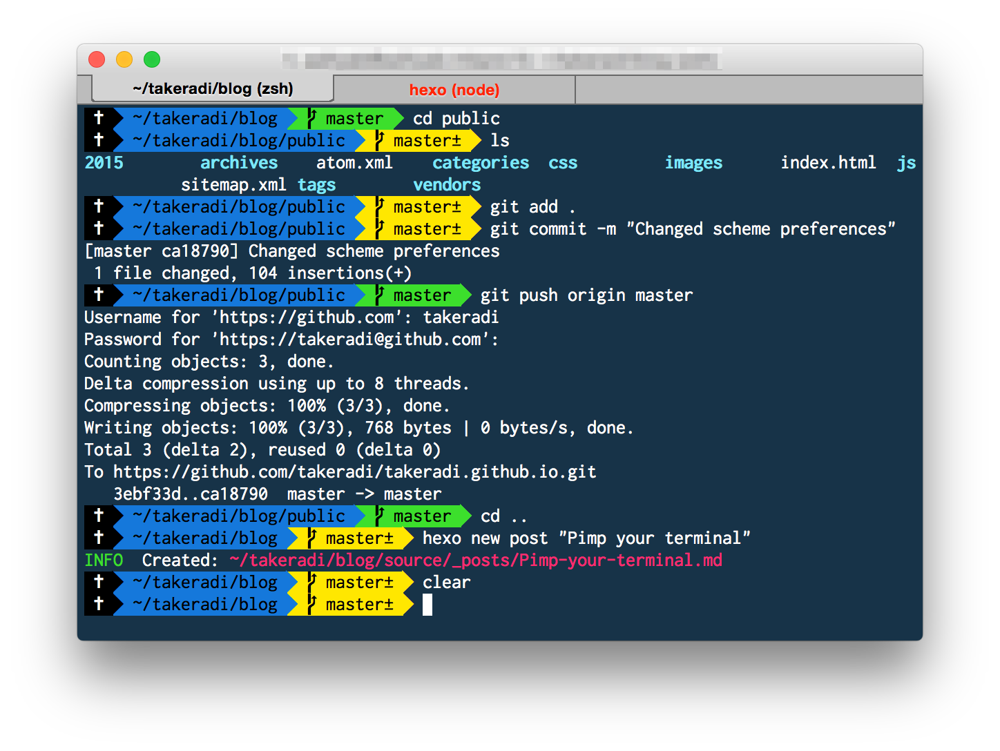
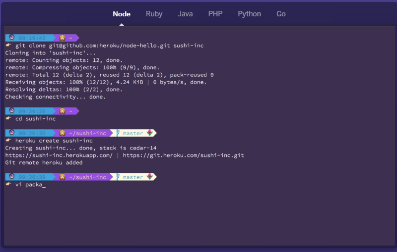

# Hey, my terminal is so ugly!
It shouldn't be! You will spend way more time then you think in it. 

In fact, during my precedent job, some days I was spending more time in my terminal then in my code editor...

So it should be a safe place. A place where you like to be and to work. Clear, cool to look at and even calming.

How? Well, there is several way of customizing you terminal!

First, you can change the colors (check in your terminal's settings).
Then, you can install additional plug-in. (look zsh and oh-my-zsh you will be amazed!)

Some examples: 

## Some incredible tutorials
* [Jazz up you ZSH](https://www.freecodecamp.org/news/jazz-up-your-zsh-terminal-in-seven-steps-a-visual-guide-e81a8fd59a38/)
* [pimp you terminal](https://cschroeter.net/pimp-your-terminal/)
* [Pimp my terminal](https://drasite.com/blog/Pimp%20my%20terminal)
* [Being more productive in your terminal](https://medium.com/@ivanaugustobd/your-terminal-can-be-much-much-more-productive-5256424658e8)

